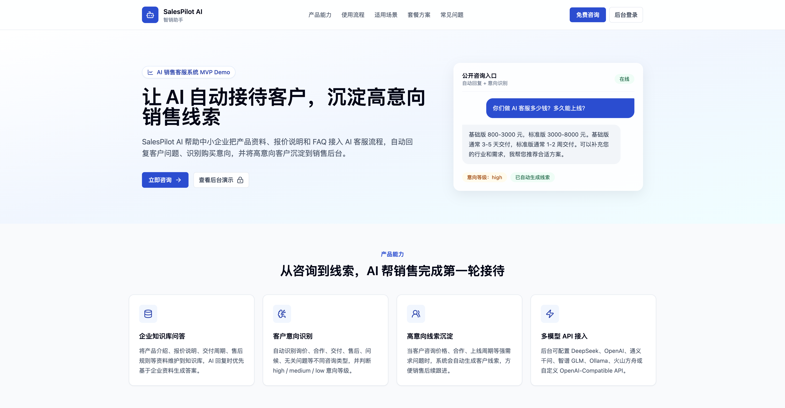
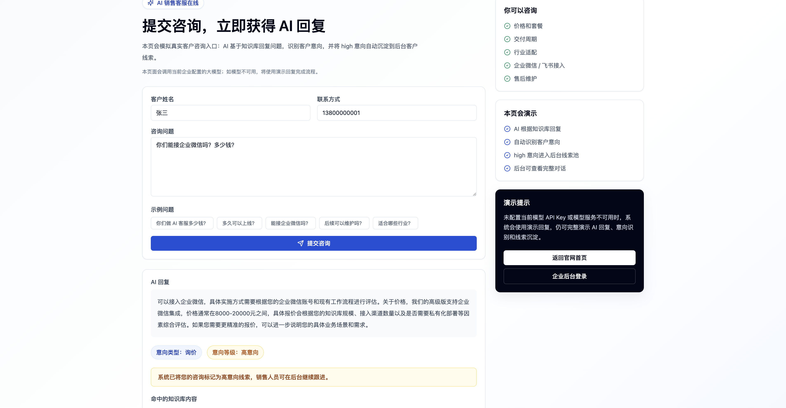
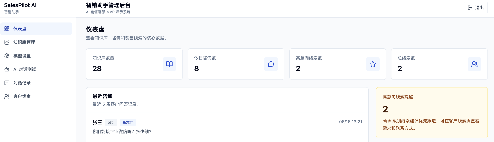
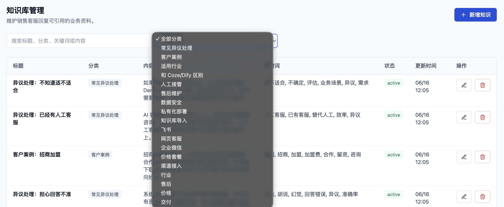
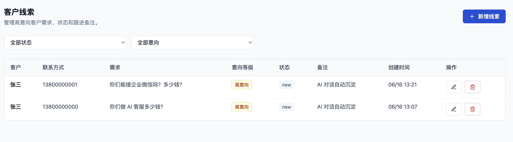
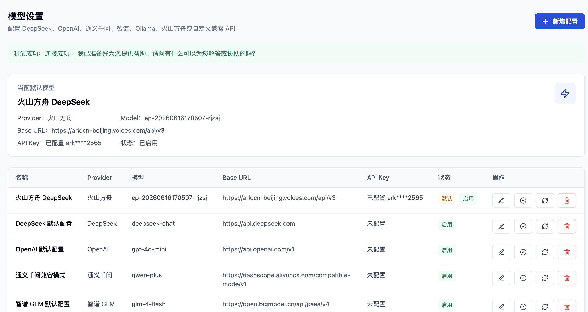

# SalesPilot AI / 智销助手

一个面向中小企业的 AI 销售客服助手 MVP / Demo 项目，用于展示全栈开发、AI 接入、知识库问答、客户线索沉淀和企业 SaaS 后台设计能力。

> 说明：当前项目定位为作品集和面试演示 Demo，不是生产可直接上线版本。认证、权限、数据安全和部署策略仍需生产化升级。

## 截图占位

截图目录已预留在 `docs/screenshots/`，后续可将真实截图放入以下路径：

| 页面 | 截图路径 |
| --- | --- |
| 官网首页 | `docs/screenshots/public-home.png` |
| 公开咨询页 | `docs/screenshots/public-chat.png` |
| 仪表盘 | `docs/screenshots/dashboard.png` |
| AI 对话测试 | `docs/screenshots/chat.png` |
| 知识库管理 | `docs/screenshots/knowledge.png` |
| 客户线索 | `docs/screenshots/leads.png` |
| 模型设置 | `docs/screenshots/ai-settings.png` |









## 核心功能

- 登录演示：默认管理员账号 `admin / admin123`
- 客户官网首页：面向客户展示产品能力、流程、场景、套餐和 FAQ
- 公开咨询页：客户无需登录即可提交咨询，触发 AI 回复和意向识别
- 仪表盘：首页统计、最近咨询、高意向线索提醒、意向等级说明
- 知识库管理：新增、编辑、删除、搜索、分类筛选、状态展示
- 简化 RAG：根据客户问题匹配知识库标题、分类、关键词和内容
- AI 对话测试：支持后台选择当前大模型；无 API Key 或调用失败时自动 mock 回复
- 模型设置：后台配置 DeepSeek、OpenAI、通义千问、智谱 GLM、Ollama 和自定义兼容 API
- 意向识别：识别询价、合作、产品、交付、售后、无关问题
- 线索沉淀：high 意向咨询自动创建客户线索
- 对话记录：查看完整问答、筛选意向等级、删除记录
- 客户线索：筛选状态和意向等级、编辑状态和备注

## 技术栈

前端：

- React
- Vite
- TypeScript
- Tailwind CSS
- React Router

后端：

- Python
- FastAPI
- SQLAlchemy
- SQLite
- Pydantic
- Uvicorn

AI：

- DeepSeek / OpenAI / 通义千问 / 智谱 GLM / Ollama / Custom Provider
- OpenAI-Compatible Chat Completions 调用格式
- Mock AI fallback
- 简化关键词 RAG，预留未来向量检索升级空间

部署：

- Docker Compose
- 轻量 Node 静态服务托管前端
- Docker volume 持久化 SQLite 数据库

## 系统架构

```text
Browser
  |
  |  React + Vite + Tailwind CSS
  v
Frontend static server
  |
  |  /api reverse proxy
  v
FastAPI Backend
  |-- Routers: auth, dashboard, knowledge, chat, public chat, conversations, leads
  |-- Services: AI service, RAG retriever, intent detector
  v
SQLite
```

后端将 AI 调用、模型配置、知识库检索和意向识别拆分到 service 层，接口层只负责请求处理和数据落库，便于后续替换模型、升级向量检索或接入更多渠道。

## 项目结构

```text
.
├── backend/
│   ├── app/
│   │   ├── main.py
│   │   ├── database.py
│   │   ├── models.py
│   │   ├── schemas.py
│   │   ├── deps.py
│   │   ├── routers/
│   │   ├── services/
│   │   └── seed.py
│   ├── Dockerfile
│   ├── requirements.txt
│   ├── .env.example
│   └── README.md
├── frontend/
│   ├── src/
│   ├── Dockerfile
│   ├── server.mjs
│   ├── package.json
│   └── README.md
├── docs/screenshots/
├── docker-compose.yml
├── .env.example
└── README.md
```

## 本地开发启动

后端：

```bash
cd backend
python3 -m venv .venv
source .venv/bin/activate
pip install -r requirements.txt
cp .env.example .env
python -m app.seed
uvicorn app.main:app --reload --port 8000
```

前端：

```bash
cd frontend
npm install
npm run dev
```

访问地址：

```text
http://localhost:5173
```

## Docker Compose 启动

根目录提供了 Docker Compose 配置：

```bash
cp .env.example .env
docker compose up --build
```

如果 Docker Hub 网络不稳定、BuildKit 拉取镜像元数据超时，可使用备用启动命令：

```bash
env DOCKER_BUILDKIT=0 COMPOSE_DOCKER_CLI_BUILD=0 docker compose up --build
```

访问地址：

```text
http://localhost:5173
```

后端 API 也会暴露到：

```text
http://localhost:8000
```

Docker 环境中，前端容器负责两件事：

- 托管前端构建后的静态页面
- 将 `/api` 请求反向代理到 backend 容器

SQLite 默认使用 Docker volume 持久化到 `/data/salespilot.db`，避免容器重启导致数据丢失。

Docker 启动后可用以下命令做基础验证：

```bash
curl http://localhost:8000/api/health
curl -I http://localhost:5173
```

## 环境变量

本地后端环境变量位于 `backend/.env`，Docker Compose 可使用根目录 `.env`。

```env
AI_PROVIDER=deepseek
AI_API_KEY=
AI_BASE_URL=
AI_MODEL=
DEEPSEEK_API_KEY=
DEEPSEEK_BASE_URL=https://api.deepseek.com
DEEPSEEK_MODEL=deepseek-chat
OPENAI_API_KEY=
OPENAI_BASE_URL=https://api.openai.com/v1
OPENAI_MODEL=gpt-4o-mini
QWEN_API_KEY=
QWEN_BASE_URL=https://dashscope.aliyuncs.com/compatible-mode/v1
QWEN_MODEL=qwen-plus
ZHIPU_API_KEY=
ZHIPU_BASE_URL=https://open.bigmodel.cn/api/paas/v4
ZHIPU_MODEL=glm-4-flash
OLLAMA_API_KEY=
OLLAMA_BASE_URL=http://localhost:11434/v1
OLLAMA_MODEL=qwen2.5:7b
DATABASE_URL=sqlite:///./salespilot.db
APP_TIMEZONE=Asia/Shanghai
```

Docker Compose 默认会使用：

```env
DATABASE_URL=sqlite:////data/salespilot.db
```

`DEEPSEEK_API_KEY` 为空时，后端会自动返回 mock 回复，方便本地完整演示。

数据库中的后台默认模型配置优先于环境变量。环境变量保留为 fallback：当没有数据库默认配置、没有传入数据库会话或本地初始化尚未完成时，AI 服务会读取 `AI_PROVIDER`、`AI_API_KEY`、`AI_BASE_URL`、`AI_MODEL` 以及各 Provider 专用变量。

## 后台多模型配置

系统支持在后台「模型设置」页面配置多个模型 Provider：

- DeepSeek
- OpenAI
- 通义千问
- 智谱 GLM
- Ollama
- 自定义 OpenAI-Compatible API

同一时间只有一个默认模型生效。AI 对话接口 `POST /api/chat` 会使用当前默认模型配置生成回复。

如果当前默认模型未配置 API Key、配置错误、请求失败或响应格式异常，后端会自动使用 mock fallback，保证 Demo 流程仍可演示。Ollama 配置允许 API Key 为空。

API Key 当前存储在 SQLite 中，这是 MVP 简化实现；接口返回给前端时只会返回是否已配置和脱敏预览，不会返回完整 API Key。真实生产环境建议加密存储 API Key，或接入 KMS、Vault、云厂商密钥管理服务。

Docker 中访问宿主机 Ollama 时，`base_url` 可能需要配置为：

```text
http://host.docker.internal:11434/v1
```

也可以按实际 Docker 网络配置改为对应容器名或网关地址。

## 公开官网与客户咨询页

- `/` 是客户官网首页，用于展示 SalesPilot AI 的产品能力、使用流程、适用场景、套餐方案和常见问题。
- `/public-chat` 是公开客户咨询页，客户无需登录即可提交姓名、联系方式和咨询问题。
- 公开咨询页调用 `POST /api/public/chat`，复用后台 AI 对话逻辑，包括知识库检索、AI 回复、意向识别、对话记录保存和 high 意向线索沉淀。
- high 意向咨询会自动进入后台「客户线索」，企业销售可登录后台继续跟进。
- 后台登录地址为 `/login`，默认账号为 `admin`，默认密码为 `admin123`。

## 默认账号密码

- 用户名：`admin`
- 密码：`admin123`

## 推荐演示流程

1. 打开官网首页：`http://localhost:5173/`
2. 点击“立即咨询”，进入 `/public-chat`。
3. 输入：
   - 姓名：`张三`
   - 联系方式：`13800000000`
   - 问题：`你们能接企业微信吗？多少钱？`
4. 查看 AI 回复、意向类型、意向等级和 high 线索提示。
5. 打开 `/login`，使用 `admin / admin123` 登录后台。
6. 进入客户线索页面，查看刚刚自动沉淀的 high 线索。
7. 进入对话记录页面，查看完整咨询记录。
8. 进入模型设置页面，展示多模型 API 配置能力。

可选后台演示流程：

1. 查看仪表盘统计，包括知识库数量、今日咨询数、高意向线索和最近咨询。
2. 进入知识库，展示价格、交付、售后等内置资料。
3. 新增一条“企业微信接入”知识：
   - 标题：`企业微信接入`
   - 分类：`渠道接入`
   - 关键词：`企业微信, 企微, 微信, 客服, 渠道`
   - 内容：`系统可根据客户需求对接企业微信、飞书、网页客服等渠道，高级版支持多渠道统一接待和线索沉淀。`
4. 进入 AI 对话测试，输入：`你们能接企业微信吗？多少钱？`
5. 展示系统根据知识库生成回复，并识别为 high 意向。

## API 能力概览

认证：

- `POST /api/auth/login`

仪表盘：

- `GET /api/dashboard/summary`

模型设置：

- `GET /api/ai-settings/configs`
- `GET /api/ai-settings/current`
- `POST /api/ai-settings/configs`
- `PUT /api/ai-settings/configs/{id}`
- `POST /api/ai-settings/configs/{id}/set-default`
- `POST /api/ai-settings/configs/{id}/test`
- `DELETE /api/ai-settings/configs/{id}`

知识库：

- `GET /api/knowledge`
- `GET /api/knowledge/{id}`
- `POST /api/knowledge`
- `PUT /api/knowledge/{id}`
- `DELETE /api/knowledge/{id}`

AI 对话：

- `POST /api/chat`
- `POST /api/public/chat`

对话记录：

- `GET /api/conversations`
- `GET /api/conversations/{id}`
- `DELETE /api/conversations/{id}`

客户线索：

- `GET /api/leads`
- `GET /api/leads/{id}`
- `POST /api/leads`
- `PUT /api/leads/{id}`
- `DELETE /api/leads/{id}`

## 演示数据重置

本地开发环境重新导入种子数据：

```bash
cd backend
source .venv/bin/activate
python -m app.seed
```

如果想完全清空本地 SQLite 数据库后重新初始化：

```bash
rm backend/salespilot.db
cd backend
source .venv/bin/activate
python -m app.seed
```

Docker 环境清空 volume 并重新启动：

```bash
docker compose down -v
docker compose up --build
```

后端容器启动时会执行 `python -m app.seed`，种子数据脚本是幂等的，不会重复插入同名内置知识。

本项目没有引入数据库迁移系统。新增表结构会通过 SQLAlchemy `create_all()` 创建；如旧数据库中缺少新表或默认模型配置，可执行：

```bash
cd backend
source .venv/bin/activate
python -m app.seed
```

如果本地演示数据可丢弃，也可以删除 SQLite 文件后重新 seed。

## 项目亮点

- 完整 MVP 闭环：知识库、AI 回复、意向识别、对话记录、线索沉淀
- AI 服务层独立封装：多模型配置、OpenAI-Compatible 调用和 mock fallback 不侵入路由层
- 简化 RAG 结构清晰：第一版用关键词匹配，保留向量检索升级空间
- 企业 SaaS 后台风格：左侧导航、仪表盘、表格、筛选、弹窗表单
- 本地和 Docker 两种启动方式：适合作品集、面试和客户演示
- SQLite 数据持久化：Docker 环境通过 volume 保留演示数据

## 当前限制

- 认证是演示版简化实现，固定账号和简单 token 仅用于 Demo
- 未实现 JWT、刷新 token、RBAC 权限和多用户管理
- 密码哈希、审计日志、限流、防暴力破解等生产安全能力尚未加入
- RAG 仍为关键词检索，没有向量数据库、Embedding 和重排
- API Key 当前明文存储在 SQLite 中，仅适合 MVP 演示
- SQLite 适合本地演示，不适合高并发生产场景
- npm audit 中 Vite/esbuild 相关 high 警告尚未强制升级

生产化时应升级为 JWT 或服务端会话认证，使用 bcrypt/passlib 存储密码哈希，并通过环境变量或配置中心管理管理员账号、token 和密钥。

## 后续路线图

- 登录升级为 JWT、RBAC 权限和用户管理
- 知识库升级为文件上传、批量导入、向量检索和召回重排
- 接入企业微信、飞书、微信公众号、网页客服等多渠道
- 增加线索跟进阶段、销售提醒、统计报表和导出能力
- 增加 Docker Compose 生产配置、反向代理、HTTPS 和云数据库
- 增加测试用例、CI、API 文档导出和示例截图
